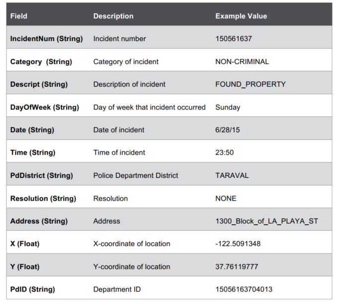
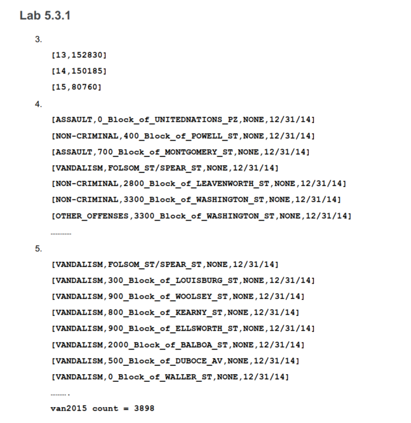

# Lab : Work with DataFrames

#### Pre-reqs:
- Google Chrome (Recommended)

#### Lab Environment
There is no requirement for any setup.

**Note:** 
- Answers and solutions can be found in the files which are already opened in jupyertLab editor. Copy and paste the solution in the terminal(s) running spark-shell(Scala) or pyspark(Python).
- Elev8ed Notebooks (powered by Jupyter) will be accessible at the port given to you by your instructor. Password for jupyterLab : `1234`

All Notebooks are present in `work/spark-dev3600` folder. To copy and paste: use **Control-C** and to paste inside of a terminal, use **Control-V**

You can access jupyter lab at `<host-ip>:<port>/lab/workspaces/lab6`

<h4><span style="color:red;">Lab Overview </span></h4>

In this activity, you will load SFPD data from a CSV file. You will create pair RDD and apply pair RDD
operations to explore the data.

**Scenario**

Our dataset is a .csv file that consists of SFPD incident data from SF OpenData (https://data.sfgov.org/).
For each incident, we have the following information:
Field



We will use this same dataset for all the labs in this course.

## Lab 5.1: Create DataFrame Using Reflection
Estimated time to complete: 20 minutes

**Objectives**

- Launch the Spark interactive shell
- Create RDD
- Create DataFrame using reflection to infer schema

## Lab 5.1.1: Launch the Spark Interactive Shell
The Spark interactive shell is available in Scala or Python.

**Note:** All instructions here are for Scala.

To launch the Interactive Shell, at the command line, run the following command:
`spark-shell --master local[2]`

**Note:** To quit the Scala Interactive shell, use the command
`:q`

## Lab 5.1.2: Create RDD
The data we want to load is in the file sfpd.csv. To load the data, we are going to use the
SparkContext method textFile. SparkContext is available in the interactive shell as the variable
sc. We also want to split the file by the separator “,”.
To load data into Spark, at the Scala command prompt:

```
val sfpdRDD = sc.textFile("/path to file/sfpd.csv").map(_.split(","))
```


<span style="color:red;">Caution!</span> If you do not have the correct path to the file sfpd.csv, you will get an error when you
perform any actions on the RDD.

## Lab 5.1.3: Create DataFrame Using Reflection to Infer Schema
In this activity, you will create a DataFrame from the RDD created in the previous activity using reflection
to infer schema.
1. Import required classes.
import sqlContext._

import sqlContext.implicits._
2. Define case class. The case class defines the table schema. You specify the name of the class,
each field and type. Below is the list of fields and type.


To define the case class Incidents, complete the statement below:

```
case class Incidents(incidentnum:String, category:String,
description:__________, dayofweek:__________, date:__________,
time:__________, pddistrict:__________, resolution:__________,
address:__________, X:__________, Y:__________, pdid:__________)
```

3. Convert RDD (sfpdRDD) into RDD of case objects (sfpdCase) using the map transformation to
map the case class to every element in the RDD.

```
val sfpdCase = sfpdRDD.map(inc=>Incidents(inc(0), inc(1), inc(2),
inc(3), inc(4),inc(5), inc(6), inc(7), inc(8), inc(9).toFloat,
inc(10).toFloat, inc(11)))
```

4. Implicitly convert resulting RDD of case objects into a DataFrame. (Hint: Use to.DF() method
on RDD)
val sfpdDF = ___________________________________
5. Register the DataFrame as a table called sfpd.
sfpdDF.________________________________________

**Q:** Why do we register the DataFrame as a table?

**A:** Registering a DataFrame as a table enables you to query it using SQL.

## Lab 5.2: Explore Data in DataFrames
Estimated time to complete: 20 minutes

In this activity, you will use DataFrame operations and SQL to explore the data in the DataFrames. Use
DataFrame operations or SQL queries to answer the questions below.

**Note:** Refer to the following links for more help on DataFrames.
- https://spark.apache.org/docs/1.3.1/sql-programming-guide.html
- https://spark.apache.org/docs/1.3.1/api/scala/index.html#org.apache.spark.sql.DataFrame

1. What are the top five districts with the most number of incidents? (Hint: Use groupBy; count;
sort. You can use show(5) to show five elements.)
val incByDist = sfpdDF.__________________________________________
_________________________________________________________________
Hint: You pass in the SQL query within the parenthesis. For example:
sqlContext.sql("SELECT <column>, count(incidentnum)
AS inccount FROM <DataFrame Table> GROUP BY <column>
ORDER BY inccount <SORT ORDER> LIMIT <number of records>")
val incByDistSQL = sqlContext.sql("_____________________________

_______________________________________________________________")

2. What are the top 10 resolutions?
val top10Res = sfpdDF.___________________________________________

_________________________________________________________________
val top10ResSQL = sqlContext.sql("_______________________________
_______________________________________________________________")
3. What are the top three categories of incidents?
val top3Cat = sfpdDF.___________________________________________
________________________________________________________________

val top3CatSQL = sqlContext.sql("_______________________________

_______________________________________________________________")
4. Save the top 10 resolutions to a JSON file in the folder /home/jovyan/work/spark-dev3600/output.


Hint: Use DF.toJSON.saveAsTextFile


**Note:** This method has been deprecated in Spark 1.4. Use:
DF.write.format("json").mode("<mode type>").save("<path to file>")
https://spark.apache.org/docs/1.4.1/sql-programming-guide.html#generic-loadsave-functions

<span style="color:red;">Caution!</span> If the folder already exists, you will get an error. You need to delete the output
directory first or add logic to remove the directory if it exists before saving.
top10ResSQL._____________________________________________________
To verify that the data was saved to the file:
cd /home/jovyan/work/spark-dev3600/output
cat part-00000

## Lab 5.3: Create and Use User Defined Functions
Estimated time to complete: 20 minutes

The date field in this dataset is a String of the form “mm/dd/yy”. We are going to create a function to
extract the year from the date field. There are two ways to use user defined functions with Spark
DataFrames. You can define it inline and use it within DataFrame operations or use it in SQL queries.
We can then Find Answers
 to questions such as: What is the number of incidents by year?

**Objectives**

-Create and use UDF with DataFrames Operations
-Create and use UDF in SQL queries

## Lab 5.3.1: Create and use UDF in SQL queries
1. Define a function that extracts characters after the last ‘/’ from the string.

```
def getyear(s:String):String = {

val year = ____________________________________________________

year
}
```

**Q:** What do we need to do in order to use this function in SQL queries?

**A:** Register this function as a UDF. Use sqlContext.udf.register.

2. Register the function.

```
sqlContext.udf.register.("functionname",functionname _)
```


**Note:** The second parameter to the register function can be used to define the UDF inline.
If you have already defined the function, then this parameter consists of the function name
followed by _. There is a space before the underscore. This is specific to Scala. The
underscore turns the function into a partially applied function that can be passed to register.
The underscore tells Scala that we don't know the parameter yet, but want the function as a
value. The required parameter will be supplied later

3. Using the registered the UDF in a SQL query, find the count of incidents by year.
val incyearSQL = sqlContext.sql("SELECT getyear(date),
count(incidentnum) AS countbyyear FROM sfpd
GROUP BY getyear(date) ORDER BY countbyyear DESC")
4. Find the category, address, and resolution of incidents reported in 2014.
val inc2014 = sqlContext.sql(._____________________________________
5. Find the addresses and resolution of vandalism incidents in 2015.
val van2014 = sqlContext.sql("___________________________________
________________________________________________________________")

Try this! Try creating other functions. For example, a function that extracts the month, and use
this to see which month in 2015 has the most incidents.

## Lab 5.4 Build a Standalone Application (Optional)
Estimated time to complete: 30 minutes
Now that you have explored DataFrames and created simple user defined functions, build a standalone
application using DataFrames that:

- Loads sfpd.csv
- Creates a DataFrame (inferred schema by reflection)
- Registers the DataFrame as a table
- Prints the top three categories to the console
- Finds the address, resolution, date and time for burglaries in 2015
- Saves this to a JSON file in a folder /<user home>/appoutput


**High Level steps:**

-Use Lab 5.1 to load the data

-Use Lab 5.2.1 to create the DataFrame and register as a table

-Refer to Lab 5.2.2 to get the top three categories

-Refer to Lab 5.3 to create a UDF that extracts the year

-Refer to Lab 5.2.2 to save to a JSON file

<h4><span style="color:red;">Answers</span></h4>





## Solutions

**Note:** Solutions are also in the file Lab5.scala from which you can copy and paste into the
Interactive shell.

## Lab 5.1.2 – Scala
1. val sfpdRDD = sc.textFile("/path to file/sfpd.csv").map(_.split(","))


## Lab 5.1.3 – Scala
1. import sqlContext._
2. import sqlContext.implicits._
3. case class Incidents(incidentnum:String, category:String,
description:String, dayofweek:String, date:String,
time:String, pddistrict:String, resolution:String,
address:String, X:Float, Y:Float, pdid:String)
4. val sfpdCase=sfpdRDD.map(inc=>Incidents(inc(0),inc(1),
inc(2),inc(3),inc(4),inc(5),inc(6),inc(7),inc(8),
inc(9).toFloat,inc(10).toFloat, inc(11)))
5. val sfpdDF=sfpdCase.toDF()
6. sfpdDF.registerTempTable("sfpd")

## Lab 5.2 – Scala
1. val incByDist =
sfpdDF.groupBy("pddistrict").count.sort($"count".desc).show(5)

val topByDistSQL = sqlContext.sql("SELECT pddistrict,
count(incidentnum) AS inccount FROM sfpd GROUP BY pddistrict ORDER BY
inccount DESC LIMIT 5")

2. val top10Res = sfpdDF.groupBy("resolution").count.sort($"count".desc)
top10Res.show(10)

val top10ResSQL = sqlContext.sql("SELECT resolution, count(incidentnum)
AS inccount FROM sfpd GROUP BY resolution ORDER BY inccount DESC LIMIT
10")

3. val top3Cat =
sfpdDF.groupBy("category").count.sort($"count".desc).show(3)

val top3CatSQL=sqlContext.sql("SELECT category, count(incidentnum) AS
inccount FROM sfpd GROUP BY category ORDER BY inccount DESC LIMIT 3")

4. top10ResSQL.toJSON.saveAsTextFile("/<userhome>/output")

## Lab 5.3.1 – Scala
1. def getyear(s:String):String = {
val year = s.substring(s.lastIndexOf('/')+1)
year
}
2. sqlContext.udf.register("getyear",getyear _)

3. val incyearSQL=sqlContext.sql("SELECT getyear(date), count(incidentnum)
AS countbyyear FROM sfpd GROUP BY getyear(date) ORDER BY countbyyear
DESC")
incyearSQL.collect.foreach(println)

4. val inc2014 = sqlContext.sql("SELECT category,address,resolution, date
FROM sfpd WHERE getyear(date)='14'")
inc2014.collect.foreach(println)

5. val van2015 = sqlContext.sql("SELECT category,address,resolution, date
FROM sfpd WHERE getyear(date)='15' AND category='VANDALISM'")
van2015.collect.foreach(println)
van2015.count


