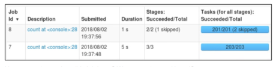
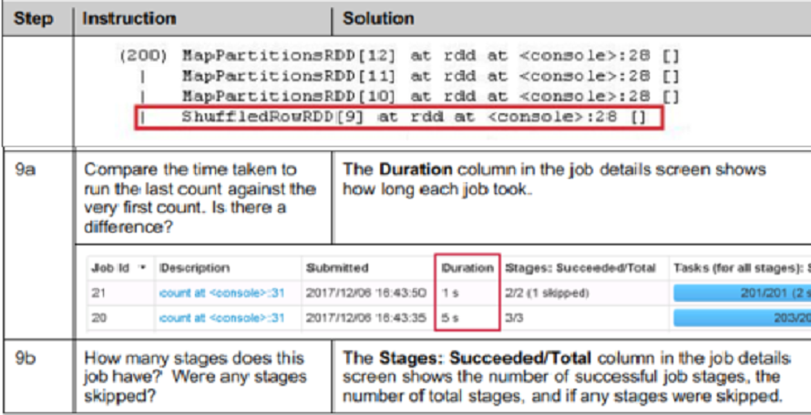
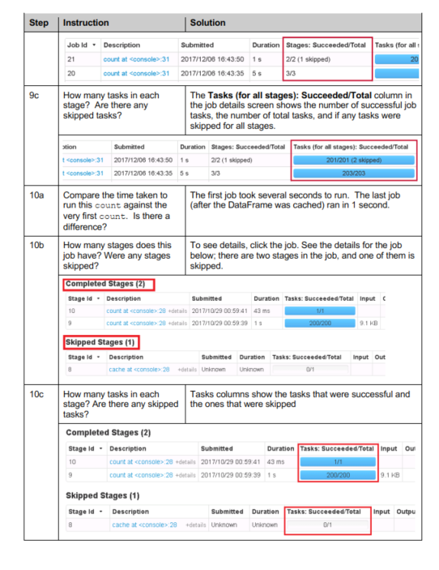
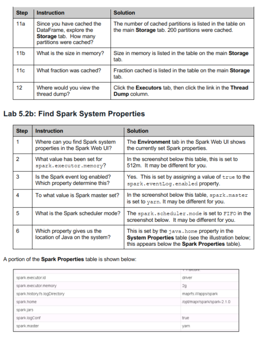
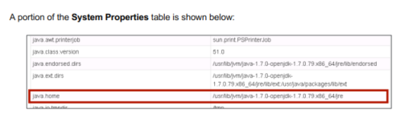

# Lab : Monitor Apache Spark Applications

#### Pre-reqs:
- Google Chrome (Recommended)

#### Lab Environment
There is no requirement for any setup.


**Note:** 
- Answers and solutions at the end of this lab. Run command `spark-shell` in the terminal.
- Spark Labs (powered by Jupyter) will be accessible at the port given to you by your instructor. Password for jupyterLab : `1234`

All labs are present in `work/spark-dev3600` folder. To copy and paste: use **Control-C** and to paste inside of a terminal, use **Control-V**

You can access jupyter lab at `<host-ip>:<port>/lab/workspaces/lab7`

<h4><span style="color:red;">Lab 5.2a: Use the Spark UI</span></h4>

Estimated time to complete: 15 minutes

In this activity, you will look at Spark execution components in the Spark UI.
1. Launch the spark interactive shell, if it’s not already running `spark-shell`
2. Load the data:

```
val sfpdDF = spark.read.format("csv").option("inferSchema",
true).load("/home/jovyan/work/spark-dev3600/data/sfpd.csv").toDF("incidentnum",
"category", "description", "dayofweek", "date", "time",
"pddistrict", "resolution", "address", "X", "Y", "pdid")
```

3. Apply a transformation to the input DataFrame to create an intermediate DataFrame:

```
val resolutionDF = sfpdDF.select("resolution").distinct
```

4. View the lineage of resolutions:

```
resolutionDF.rdd.toDebugString
```

Answer the following questions:
    - Identify the lines in the lineage that correspond to the input DataFrame (sfpdDF).
    - Identify which transformation creates a shuffle.

5. Determine the total number of resolutions:

```
val totres = resolutionDF.count
```

6. Verify above code output is: 

```
scala> val totres = resolutionDF.count
totres: Long = 17   
```

7. Cache resolutionDF by running: 

```
resolutionDF.cache()
```

8. Run the count again so the DataFrame is cached. Then run count again to use the cached DataFrame.

```
resolutionDF.count
resolutionDF.count
```

9. Open another browser tab and navigate to the Spark web UI `http://<host-ip>::4040`.
    a. Compare the time taken to run the last count against the very first count. Is there a
    difference?
    b. How many stages does this job have? Were any stages skipped?
    c. How many tasks in each stage? Are there any skipped tasks?

    

10. Since you have cached the DataFrame, explore the Storage tab and answer the following
questions:
    a. How many partitions were cached?
    b. What is the size in memory?
    c. What fraction was cached?
11. Explore other tabs in the Web UI. Where would you view the thread dump?

<h4><span style="color:red;">Lab 5.2b: Find Spark System Properties</span></h4>

Estimated time to complete: 10 minutes

Spark properties control most of the application settings and are configured separately for each
application. SparkSession allows you to configure some of the common properties through the
config() method. You can set these properties directly on the SparkSession. For example:

```
import org.apache.spark.sql.SparkSession
val spark = SparkSession.builder().master("local[2]").appName("SFPD Incidents").config("spark.executor.memory","1g").getOrCreate()
```

You can also load these properties when calling spark-submit.

Use the Spark Web UI (`http://<host-ip>:4040`) to answer the following questions:
1. Where can you find Spark system properties in the Spark Web UI?
2. What value has been set for spark.executor.memory?
3. Is the Spark event log enabled? Which property determines this?
4. To what value is Spark master set?
5. What is the Spark scheduler mode?
6. Which property gives you the location of Java on the system?

Some examples of Spark properties are listed below.
- **spark.executor.memory** – This indicates the amount of memory to be used per executor.
- **spark.serializer** – Class used to serialize objects that will be sent over the network. Use the org.apache.spark.serializer.JavaSerializer class to get better performance, since
    the default java serialization is quite slow.
- **spark.kryo.registrator** – Class used to register the custom classes if you use the Kyro
    serialization
- **org.apache.spark.sql.Encoders** – Specialized class used to serialize Dataset objects
- **spark.local.dir** – Locations that Spark uses as scratch space to store the map output files.

**Environment Variables:** Some of the Spark settings can be configured using the environment variables
that are defined in the conf/spark-env.sh script file. These are machine-specific settings, such as
library search path, Java path, etc.









