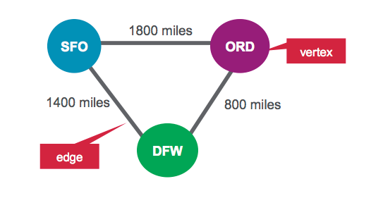
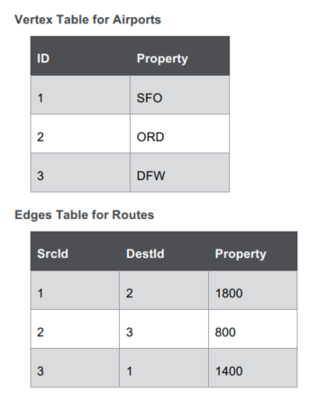
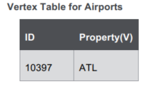
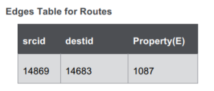

# Lab : Use Apache Spark GraphX to Analyze Flight Data

#### Pre-reqs:
- Google Chrome (Recommended)

#### Lab Environment
There is no requirement for any setup.

**Note:** 
- Answers and solutions can be found in the files which are already opened in jupyertLab editor. Copy and paste the solution in the terminal(s) running spark-shell(Scala) or pyspark(Python).
- Elev8ed Notebooks (powered by Jupyter) will be accessible at the port given to you by your instructor. Password for jupyterLab : `1234`

All Notebooks are present in `work/spark-dev3600` folder. To copy and paste: use **Control-C** and to paste inside of a terminal, use **Control- V**

You can access jupyter lab at `<host-ip>:<port>/lab/workspaces/lab8`

<h4><span style="color:red;">Analyzing a Simple Flight Example with GraphX</span></h4>

### Scenario
In this activity, you will use GraphX to analyze flight data. As a starting simple example, we will analyze
three flights. For each flight, we have the following information:


In this scenario, we are going to represent the airports as vertices and routes as edges. For our graph, we
will have three vertices, each representing an airport. The distance between the airports is a route
property, as shown below:





**Objectives**

- Define Vertices
- Define Edges
- Create Graph
- Launch the Spark Interactive Shell

In this activity, we will use the Spark Interactive Shell.
- To launch the Interactive Shell, run the following command at the command line: `spark-shell --master local[2]`

## Define Vertices
Open the file 09_Graphx_Lab_Shell_1.scala in your favorite editor. All the shell commands are
there, or you can copy paste from this document.
First we will import the GraphX packages.

In the code boxes, comments are in green and output is in purple.

```
import org.apache.spark._

import org.apache.spark.rdd.RDD

// import classes required for using GraphX
import org.apache.spark.graphx._
```

We define airports as vertices. Vertices have an ID and can have properties or attributes associated with
them. Each vertex consists of:

- Vertex ID -> id (Long)
- Vertex Property -> name (String)

Vertex Table for Airports


We define an RDD with the above properties that is then used for the vertices.

```
// create vertices RDD with ID and Name

val vertices=Array((1L, ("SFO")),(2L, ("ORD")),(3L,("DFW")))
val vRDD= sc.parallelize(vertices)
vRDD.take(1)

// Array((1,SFO))
// Defining a default vertex called nowhere
val nowhere = "nowhere"
```

## Define Edges
Edges are the routes between airports. An edge must have a source, a destination, and can have
properties. In our example, an edge consists of:

- Edge origin ID -> src (Long)
- Edge destination ID -> dest (Long)
- Edge property distance -> distance (Long)


### Edges Table for Routes


We define an RDD with the above properties that is then used for the edges. The edge RDD has the form
(src id, dest id, distance).

```
// create routes

RDD with srcid, destid , distance

val edges = Array(Edge(1L,2L,1800),Edge(2L,3L,800),Edge(3L,1L,1400))
val eRDD= sc.parallelize(edges)
eRDD.take(2)

// Array(Edge(1,2,1800), Edge(2,3,800))

Create Property Graph
To create a graph, you need to have a Vertex RDD, Edge RDD and a Default vertex.
Create a property graph called graph:
// define the graph

val graph = Graph(vRDD,eRDD, nowhere)
// graph vertices

graph.vertices.collect.foreach(println)
// (2,ORD)
// (1,SFO)
// (3,DFW)
// graph edges

graph.edges.collect.foreach(println)
// Edge(1,2,1800)
// Edge(2,3,800)

// Edge(3,1,1400)
```


1. How many airports are there?

```
// How many airports?

val numairports = graph.numVertices
// Long = 3
```

2. How many routes are there?

```
// How many routes?

val numroutes = graph.numEdges
// Long = 3
```

3. Which routes are greater than 1000 miles in distance?

```
// routes > 1000 miles distance?

graph.edges.filter {
case Edge(src, dst, prop) => prop > 1000
}.collect.foreach(println)
// Edge(1,2,1800)

// Edge(3,1,1400)
```

4. The EdgeTriplet class extends the Edge class by adding the srcAttr and dstAttr
members which contain the source and destination properties respectively.

```
// triplets

graph.triplets.take(3).foreach(println)
((1,SFO),(2,ORD),1800)
((2,ORD),(3,DFW),800)

((3,DFW),(1,SFO),1400)
```

5. Sort and print out the longest distance routes.

```
// print out longest routes

graph.triplets.sortBy(_.attr,
ascending=false).map(triplet =>

"Distance " + triplet.attr.toString + " from " +
triplet.srcAttr + " to " + triplet.dstAttr + ".")
.collect.foreach(println)
```

Distance 1800 from SFO to ORD.
Distance 1400 from DFW to SFO.
Distance 800 from ORD to DFW.


## Lab 9.2: Analyze Real Flight Data with GraphX
Estimated time to complete: 25 minutes

Our data is from http://www.transtats.bts.gov/DL_SelectFields.asp?Table_ID=236&DB_Short_Name=OnTime. We are using flight information for January 2015. For each flight, we have the following information:
Field


In this scenario, we are going to represent the airports as vertices and routes as edges. We are interested
in visualizing airports and routes and would like to see the number of airports that have departures or
arrivals.


**Objectives**

-Define Vertices
-Define Edges
-Create Graph

## Launch the Spark Interactive Shell
In this activity we will use the Spark Interactive Shell. The Spark Interactive Shell is available in Scala or Python.


**Note:** All instructions here are for Scala.

SSH into your MapR Sandbox or cluster node. To launch the Interactive Shell, run the following command
at the command line:
`spark-shell --master local[2]`


**Note:** To quit the Scala Interactive Shell, use the command: `:q`

### Define Vertices

Open the file   `09_Graphx_Lab_Shell_2.scala` in your favorite editor. All the shell commands are
there, or you can copy paste from this document.

First we will import the GraphX packages. In the code boxes, comments are in green and output is in
blue.

```
import org.apache.spark._

import org.apache.spark.rdd.RDD

import org.apache.spark.util.IntParam

// import classes required for using GraphX
import org.apache.spark.graphx._

import org.apache.spark.graphx.util.GraphGenerators
```

Below we a Scala case classes to define the flight schema corresponding to the CSV data file.

```
// define the Flight Schema

case class Flight(dofM:String, dofW:String, carrier:String,
tailnum:String, flnum:Int, org_id:Long, origin:String,
dest_id:Long, dest:String, crsdeptime:Double, deptime:Double,
depdelaymins:Double, crsarrtime:Double, arrtime:Double,
arrdelay:Double,crselapsedtime:Double,dist:Int)
```

The function below parses a line from the data file into the Flight class.

```
// function to parse input into Flight class
def parseFlight(str: String): Flight = {
val line = str.split(",")

Flight(line(0), line(1), line(2), line(3), line(4).toInt,
line(5).toLong, line(6), line(7).toLong, line(8), line(9).toDouble,
line(10).toDouble, line(11).toDouble, line(12).toDouble,
line(13).toDouble, line(14).toDouble, line(15).toDouble,
line(16).toInt)
}
```

Below we load the data from the CSV file into a Resilient Distributed Dataset (RDD). RDDs can have
transformations and actions, the first() action returns the first element in the RDD.

```
// load the data into an RDD

val textRDD = sc.textFile("/home/jovyan/work/spark-dev3600/data/rita2014jan.csv")

// MapPartitionsRDD[1] at textFile

// parse the RDD of csv lines into an RDD of flight classes
val flightsRDD = textRDD.map(parseFlight).cache()
```


We define airports as vertices. Vertices can have properties or attributes associated with them. Each
vertex has the following property:

-Airport name (String)

**Vertex Table for Airports**



We define an RDD with the above properties that is then used for the Vertexes .

```
// create airports RDD with ID and Name

val airports = flightsRDD.map(flight => (flight.org_id,
flight.origin)).distinct
airports.take(1)

// Array((14057,PDX))
// Defining a default vertex called nowhere
val nowhere = "nowhere"

// Map airport ID to the 3-letter code to use for printlns

val airportMap = airports.map { case ((org_id), name) => (org_id ->
name) }.collect.toList.toMap
// Map(13024 -> LMT, 10785 -> BTV,…)
```

Define Edges
Edges are the routes between airports. An edge must have a source, a destination, and can have
properties. In our example, an edge consists of:
- Edge origin ID -> src (Long)

- Edge destination ID -> dest (Long)

- Edge property distance -> distance (Long)




We define an RDD with the above properties that is then used for the Edges. The edge RDD has the form
(src id, dest id, distance).

```
// create routes

RDD with srcid, destid , distance

val routes = flightsRDD.map(flight => ((flight.org_id, flight.dest_id),
flight.dist)).distinctdistinct
routes.take(2)

// Array(((14869,14683),1087), ((14683,14771),1482))
// create edges RDD with srcid, destid , distance

val edges = routes.map {

case ((org_id, dest_id), distance) =>Edge(org_id.toLong,
dest_id.toLong, distance) }

edges.take(1)

//Array(Edge(10299,10926,160))

Create Property Graph
To create a graph, you need to have a Vertex RDD, Edge RDD and a Default vertex. Create a property
graph called graph.

```
// define the graph

val graph = Graph(airports, edges, nowhere)
// graph vertices

graph.vertices.take(2)

Array((10208,AGS), (10268,ALO))
// graph edges

graph.edges.take(2)

Array(Edge(10135,10397,692), Edge(10135,13930,654))


1. How many airports are there?
// How many airports?

val numairports = graph.numVertices
// Long = 301

2. How many routes are there?
// How many airports?

val numroutes = graph.numEdges
// Long = 4090

3. Which routes are greater than 1000 miles distance?
// routes > 1000 miles distance?

graph.edges.filter { case ( Edge(org_id, dest_id,distance))=>
distance > 1000}.take(3)

// Array(Edge(10140,10397,1269), Edge(10140,10821,1670),
Edge(10140,12264,1628))

4. The EdgeTriplet class extends the Edge class by adding the srcAttr and dstAttr
members which contain the source and destination properties respectively.

```
// triplets

graph.triplets.take(3).foreach(println)
((10135,ABE),(10397,ATL),692)
((10135,ABE),(13930,ORD),654)

((10140,ABQ),(10397,ATL),1269)
```

5. Compute the highest degree vertex.

```
// Define a reduce operation to compute the highest degree vertex

def max(a: (VertexId, Int), b: (VertexId, Int)): (VertexId, Int)
= {
if (a._2 > b._2) a else b
}

val maxInDegree: (VertexId, Int) = graph.inDegrees.reduce(max)
maxInDegree: (org.apache.spark.graphx.VertexId, Int) =
(10397,152)

val maxOutDegree: (VertexId, Int) = graph.outDegrees.reduce(max)
maxOutDegree: (org.apache.spark.graphx.VertexId, Int) =
(10397,153)

val maxDegrees: (VertexId, Int) = graph.degrees.reduce(max)
val maxDegrees: (VertexId, Int) = graph.degrees.reduce(max)

airportMap(10397)
res70: String = ATL
```

6. Which airport has the most incoming flights?

```
// get top 3

val maxIncoming = graph.inDegrees.collect.sortWith(_._2 >
_._2).map(x => (airportMap(x._1), x._2)).take(3)
maxIncoming.foreach(println)
```

(ATL,152)
(ORD,145)
(DFW,143)

```
// which airport has the most outgoing flights?

val maxout= graph.outDegrees.join(airports).sortBy(_._2._1,
ascending=false).take(3)
maxout.foreach(println)
```

(10397,(153,ATL))
(13930,(146,ORD))
(11298,(143,DFW))


7. What are the top 10 flights from airport to airport?

```
// get top 10 flights airport to airport

graph.triplets.sortBy(_.attr, ascending=false).map(triplet =>
"There were " + triplet.attr.toString + " flights from " +
triplet.srcAttr + " to " + triplet.dstAttr + ".").take(3)
.foreach(println)
```

There were 4983 flights from JFK to HNL

There were 4983 flights from HNL to JFK.
There were 4963 flights from EWR to HNL

