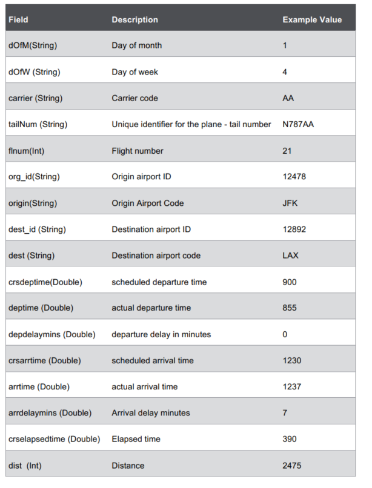

# Lab : Create Datasets

#### Pre-reqs:
- Google Chrome (Recommended)

#### Lab Environment
There is no requirement for any setup.

**Note:** 
- Solutions are present in `work/spark-dev3600/Lab2` folder. Copy and paste the solution in the terminal(s) after running command `spark-shell` (for Scala) or `pyspark` (for Python).
- Spark Labs (powered by Jupyter) will be accessible at the port given to you by your instructor. Password for jupyterLab : `1234`

All labs are present in `work/spark-dev3600` folder. To copy and paste: use **Control-C** and to paste inside of a terminal, use **Control-V**

You can access jupyter lab at `http://<lab-environment>/lab/workspaces/lab2`

The data directory contains data files that will be used in exercises.

## Lab 2.3a: Load Data and Create Datasets Using Reflection
Estimated time to complete: 20 minutes

1. Use the following command to launch the shell in Scala:

`spark-shell`

**Note:** The lab environment has Spark loaded.

2. Load the data from the file sfpd.csv, which was unzipped earlier:

```
val sfpdDF = spark.read.format("csv").option("inferSchema",
true).load("/home/jovyan/work/spark-dev3600/data/sfpd.csv").toDF("incidentnum",
"category", "description", "dayofweek", "date", "time",
"pddistrict", "resolution", "address", "x", "y", "pdid")
```

**Caution!** Use the correct file path to `sfpd.csv`. If you do not have the correct path
specified, you will get an error when you perform actions on the Dataset.

3. Import required classes:

```
import spark.implicits._
```

4. Define case class. The case class defines the table schema. You specify the name of the class,
each field, and type. Below is the list of fields and type:



To define the case class Incidents, complete the statement below:
case class Incidents(incidentnum:String, category:String,
description:__________, dayofweek:__________, date:__________,
time:__________, pddistrict:__________, resolution:__________,
address:__________, x:__________, y:__________, pdid:__________)

5. Convert the DataFrame into a Dataset of Incidents using the as method:
val sfpdDS = sfpdDF.________________________________________________
6. Register the Dataset as a table called sfpd.

**Q:** Why register the Dataset as a table?

**A:** Registering a Dataset as a table enables you to query it using SQL.

## Lab 2.3b: Word Count Using Datasets (Optional)

Estimated time to complete: 30 minutes

Try this! Try this optional lab on your own, or in class if you finish the other lab early. Follow
the steps below to implement Word Count using Datasets.

1. Launch the Spark shell, if it is not already running.
2. Load the Dataset with the file /home/jovyan/work/spark-dev3600/data/wordcount.txt using SparkSession’s
read.text method. Assign the type as string.
3. Use the Dataset’s flatmap method to split lines into words. Use “\\s+” (spaces) as word
separator.
4. Change the case of all words to lowercase using the toLowerCase method and then group them
using groupByKey.
5. Count each word in the group in the count method.
6. Display the results using show or collect methods.

<h4><span style="color:red;">Lesson 2 Answer Key</span></h4>

**Note:** Answers can be found in the files which are already opened in jupyertLab editor.
