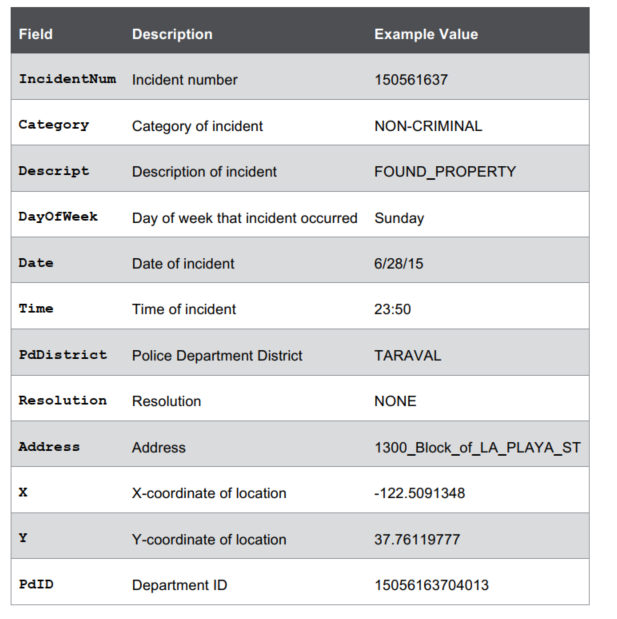
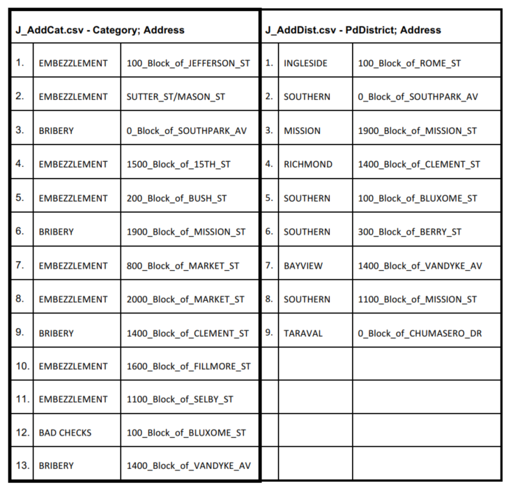
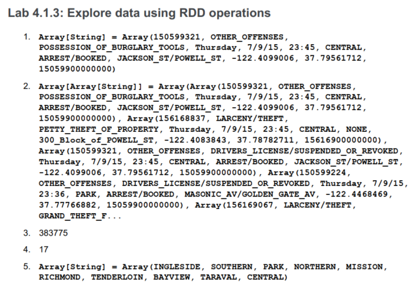
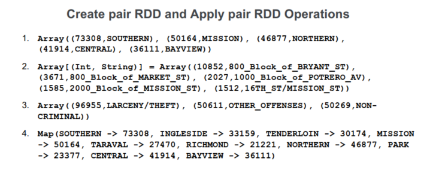
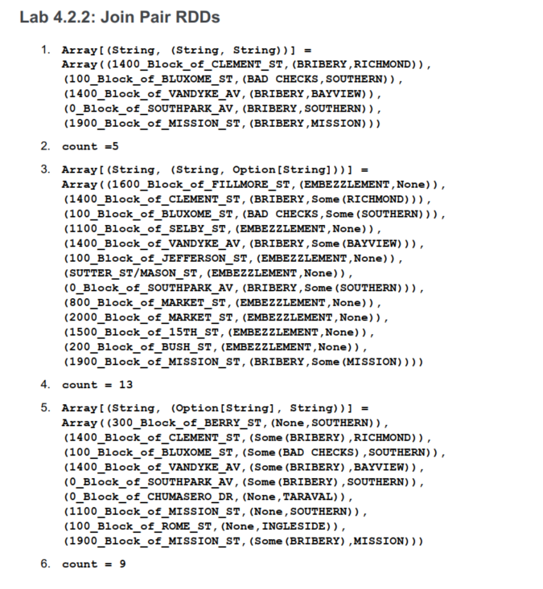

# Lab : Work with Pair RDD

#### Pre-reqs:
- Google Chrome (Recommended)

#### Lab Environment
There is no requirement for any setup.

**Note:** 
- Solutions are present in `work/spark-dev3600/Lab5` folder. Copy and paste the solution in the terminal(s) after running command `spark-shell` (for Scala) or `pyspark` (for Python).
- Spark Labs (powered by Jupyter) will be accessible at the port given to you by your instructor. Password for jupyterLab : `1234`

All labs are present in `work/spark-dev3600` folder. To copy and paste: use **Control-C** and to paste inside of a terminal, use **Control-V**

You can access jupyter lab at `http://<lab-environment>/lab/workspaces/lab5`


<h4><span style="color:red;">Lab Overview </span></h4>

In this activity, you will load SFPD data from a CSV file. You will create pair RDD and apply pair RDD
operations to explore the data.

# Scenario
Our dataset is a .csv file that consists of SFPD incident data from SF OpenData (https://data.sfgov.org/).
For each incident, we have the following information:




The dataset has been modified to decrease the size of the files, to make it easier to use. We will use this same dataset for all the labs in this course.

## Lab 4.1: Load Data into Apache Spark

Estimated time to complete: 15 minutes

**Objectives**

- Launch the Spark interactive shell
- Load data into Spark
- Explore data in Apache Spark


#### Lab 4.1.1: Launch the Spark Interactive Shell
The Spark interactive shell is available in Scala or Python.

**Note:** Solution is present in the file `LAB_5.scala` from which you can copy and paste into the interactive shell.

To launch the Interactive Shell, run the following command at the command line:
`spark-shell --master local[2]`

To quit the Scala Interactive shell, use the command:
> `:q`

#### Lab 4.1.2: Load Data into Spark
The data we want to load is in the auctiondata.csv file. To load the data, we are going to use the
SparkContext method textFile. The SparkContext is available in the interactive shell as the
variable sc. We also want to split the file by the separator “,”.

1. Define the mapping for our input variables. While this isn’t a necessary step, it makes it easier to
refer to the different fields by names.

```
val IncidntNum = 0

val Category = 1
val Descript = 2

val DayOfWeek = 3
val Date = 4
val Time = 5

val PdDistrict = 6
val Resolution = 7
val Address = 8
val X = 9

val Y = 10

val PdId = 11
```

2. To load data into Spark, at the Scala command prompt:

```
val sfpdRDD = sc.textFile("/pathtofile/sfpd.csv").map(_.split(","))
```

<span style="color:red;">Caution!</span> If you do not have the correct path to the file sfpd.csv, you will get an error when
you perform any actions on the RDD.
If you copied the files as per the directions, then the path to
the file is:

`/home/jovyan/work/spark-dev3600/data/sfpd.csv`

#### Lab 4.1.3: Explore data using RDD operations
What transformations and actions would you use in each case? Complete the command with the
appropriate transformations and actions.
1. How do you see the first element of the inputRDD (sfpdRDD)?
sfpdRDD.____________________
2. What do you use to see the first 5 elements of the RDD?
sfpdRDD.____________________
3. What is the total number of incidents?
val totincs = sfpdRDD.___________________________________________
_________________________________________________________________
4. What is the total number of distinct resolutions?
val totres = sfpdRDD.____________________________________________
_________________________________________________________________
5. List the PdDistricts.
val districts = sfpdRDD._________________________________________
_________________________________________________________________


## Lab 4.2: Create and Explore Pair RDD
Estimated time to complete: 25 minutes

In the previous activity, we explored the data in the sfpdRDD. We used RDD operations. In this activity,
we will create pair RDD to Find Answers
 to questions about the data.

**Objectives**

- Create pair RDD
- Apply pair RDD operations
- Join pair RDD

### Lab 4.2.1: Create pair RDD and apply pair RDD operations

**Note:** Find the answers and the solutions to the questions at the end of Lab 4. The solutions in
spark-shell(scala):
pyspark(python)

1. Which five districts have the highest incidents?

**Note:** This is similar to doing a word count. This is only one way of doing it. There may be
other ways of achieving the same result.

a. Use a map transformation to create a pair RDD from sfpdRDD of the form
[(PdDistrict, 1)]:
_______________________________________________________________________
b. Use reduceByKey((a,b)=>a+b) to get the count of incidents in each district. Your
result will be a pair RDD of the form [(PdDistrict, count)]:
_______________________________________________________________________
c. Use map again to get a pair RDD of the form [(count, PdDistrict)]:
_______________________________________________________________________

d. Use sortByKey(false) on [(count, PdDistrict)]:
_______________________________________________________________________
e. Use take(5) to get the top five:
_______________________________________________________________________


2. Which five addresses have the highest incidents?

    a. Create pair RDD (map).
    b. Get the count for key (reduceByKey).
    c. Pair RDD with key and count switched (map).
    d. Sort in descending order (sortByKey).
    e. Use take(5) to get the top five.
    _____________________________________________________________________________
    _____________________________________________________________________________
    _____________________________________________________________________________

3. What are the top three categories of incidents?
_____________________________________________________________________________
_____________________________________________________________________________
_____________________________________________________________________________

4. What is the count of incidents by district?
_____________________________________________________________________________
____________________________________________________________________________
_____________________________________________________________________________

<span style="color:red;">Caution!</span> For large datasets, don’t use countByKey.

# Lab 4.2.2: Join Pair RDDs

This activity illustrates how joins work in Spark (Scala). There are two small datasets provided for this activity: J_AddCat.csv and J_AddDist.csv.



Based on the data above, answer the following questions:
1. Given these two datasets, you want to find the type of incident and district for each address. What
is one way of doing this? (HINT: An operation on pairs or pairRDDs). What should the keys be for
the two pairRDDs?
_____________________________________________________________________________
_____________________________________________________________________________


2. What is the size of the resulting dataset from a join? Why?


**Note:** Look at the datasets above and estimate what a join on the two would return if they were
joined on the key, from column 1.
Remember that a join is the same as an inner join and only keys that are present in both RDDs
are output.
_____________________________________________________________________________
_____________________________________________________________________________
3. If you did a right outer join on the two datasets with Address/Category being the source RDD,
what would be the size of the resulting dataset? Why?


**Note:** Remember that a right outer join results in a pair RDD that has entries for each key in
the other pair RDD.
_____________________________________________________________________________
_____________________________________________________________________________
4. If you did a left outer join on the two datasets with Address/Category being the source RDD, what
would be the size of the resulting dataset? Why?


**Note:** Remember that a left outer join results in a pair RDD that has entries for each key in the
source pair RDD.
_____________________________________________________________________________
_____________________________________________________________________________
5. Load each dataset into separate pairRDDs with address as the key.


**Note:** once you load the text file, split on the “,” and then apply the map transformation to
create a pairRDD where address is the first element of the two-tuple.
val catAdd = sc._________________________________________________
_________________________________________________________________
val distAdd = sc.________________________________________________
_________________________________________________________________


6. List the incident category and district for those addresses that have both category and district
information. Verify that the size estimated earlier is correct.
val catJdist = __________________________________________________
catJdist.collect or catJdist.take(10)
For the size:
catJdist2._______________________________________________________
7. List the incident category and district for all addresses irrespective of whether each address has
category and district information.
val catJdist1 = _________________________________________________
catJdist1.collect or catJdist.take(10)
For the size:
catJdist2._______________________________________________________
8. List the incident district and category for all addresses irrespective of whether each address has
category and district information. Verify that the size estimated earlier is correct.
val catJdist2 = _________________________________________________
catJdist2.collect or catJdist.take(10)
For the size:
catJdist2._______________________________________________________

## Lab 4.3: Explore Partitioning
Estimated time to complete: 15 minutes

In this activity, we will see how to determine the number of partitions, the type of partitioner, and how to
specify partitions in a transformation.

**Objective**

-Explore partitioning in RDDs

### Lab 4.3.1: Explore partitioning in RDDs

**Note:** To find partition size:

```
rdd.partitions.size (Scala)
rdd.getNumPartitions() (Python)
```

To determine the partitioner: `rdd.partitioner` (Scala).

1. How many partitions are there in the sfpdRDD?
sfpdRDD._________________________________________________________
2. How do you find the type of partitioner for sfpdRDD?
sfpdRDD._________________________________________________________
3. Create a pair RDD.

```
val incByDists =
sfpdRDD.map(incident=>(incident(PdDistrict),1)).reduceByKey((x,y)
=>x+y)
```

a. How many partitions does incByDists have?
incByDists.______________________________________________________
b. What type of partitioner does incByDists have?
incByDists.______________________________________________________

**Q:** Why does incByDists have that partitioner?

**A:** reduceByKey automatically uses the Hash Partitioner

4. Add a map.
val inc_map = incByDists.map(x=>(x._2,x._1))
a. How many partitions does inc_map have? _____
inc_map.______________________________________________________
b. What type of partitioner does incByDists have? ______________
inc_map.______________________________________________________

**Q:** Why does inc_map not have the same partitioner as its parent?

**A:** Transformations such as map() cause the new RDD to forget the parent’s partitioning
information because a map() can modify the key of each record.

5. Add a sortByKey.
val inc_sort = inc_map.sortByKey(false)
a. What type of partitioner does inc_sort have? ______________
inc_sort.______________________________________________________


**Q:** Why does inc_sort have this type of partitioner?

**A:** This is because sortByKey will automatically result in a range partitioned RDD..

6. Add groupByKey.
val inc_group =
sfpdRDD.map(incident=>(incident(PdDistrict),1)).groupByKey()
a. What type of partitioner does inc_group have? ______________
inc_group.______________________________________________________

**Q:** Why does inc_group have this type of partitioner?

**A:** This is because groupByKey will automatically result in a hash partitioned RDD..

7. Create two pairRDDs.
```
val catAdd =
sc.textFile("/home/jovyan/work/spark-dev3600/data/J_AddCat.csv").map(x=>x.split(",")).
map(x=>(x(1),x(0)))

val distAdd =
sc.textFile("/home/jovyan/work/spark-dev3600/data/J_AddDist.csv").map(x=>x.split(",")).
map(x=>(x(1),x(0)))
```

8. You can specify the number of partitions when you use the join operation.
val catJdist = catAdd.join(distAdd,8)
a. How many partitions does the joined RDD have? _____
catJdist.______________________________________________________
b. What type of partitioner does catJdist have? ______________
catJdist.______________________________________________________


**Note:** A join will automatically result in a hash partitioned RDD.


<h4><span style="color:red;">Answers</span></h4>









### Lab 4.3.1: Explore Partitioning in Pair RDDs

1. The answer to this will vary depending on your environment. In our training environment,
sfpdRDD has two partitions.
2. No partitioner
3. In the training environment – two partitions; Hash Partitioner
4. Same number of partitions; type of partitioner = none
5. Range partitioner
6. Hash partitioner
7. 8; Hash Partitioner


<h4><span style="color:red;">Solutions</span></h4>

#### Lab 4.1.3 – Scala


**Note:** Solutions are also in the file `LAB_5.scala` from which you can copy and paste into the interactive shell.

1. sfpdRDD.first()
2. sfpdRDD.take(5)
3. val totincs = sfpdRDD.count()
4. val totres = sfpdRDD.map(inc=>inc(Resolution)).distinct.count
5. val dists = sfpdRDD.map(inc=>inc(PdDistrict)).distinct
dists.collect

## Lab 4.1.3 – Python
To launch the Python shell:
$ `pyspark`


**Note:** Solutions are also in the file Lab4.py from which you can copy and paste in interactive shell.

To map input variables:

```
IncidntNum = 0
Category = 1
Descript = 2

DayOfWeek = 3
Date = 4
Time = 5

PdDistrict = 6
Resolution = 7
Address = 8
X = 9

Y = 10

PdId = 11
```

To load the file:

```
sfpdRDD=sc.textFile("/home/jovyan/work/spark-dev3600/data/sfpd.csv").map(lambda
line:line.split(","))
```

1. sfpdRDD.first
2. sfpdRDD.take(5)
3. totincs = sfpdRDD.count()
print totincs
4. totres = sfpdRDD.map(lambda inc:inc[Resolution]).distinct().count()
print totres
5. dists = sfpdRDD.map(lambda inc:inc[PdDistrict]).distinct().collect()
print dists


## Lab 4.2.1 – Scala

**Note:** Solutions are also in the file `LAB_5.scala` from which you can copy and paste into the interactive shell.

1. val top5Dists =
sfpdRDD.map(incident=>(incident(PdDistrict),1)).reduceByKey((x,y)=>x+y)
.map(x=>(x._2,x._1)) .sortByKey(false).take(3)
2. val top5Adds =
sfpdRDD.map(incident=>(incident(Address),1)).reduceByKey((x,y)=>x+y)
.map(x=>(x._2,x._1)) .sortByKey(false).take(5)
3. val top3Cat =
sfpdRDD.map(incident=>(incident(Category),1)).reduceByKey((x,y)=>x+y)
.map(x=>(x._2,x._1)) .sortByKey(false).take(3)
4. val num_inc_dist =
sfpdRDD.map(incident=>(incident(PdDistrict),1)).countByKey()

## Lab 4.3.1 – Python

**Note:** Solutions are also in the file Lab4.py from which you can copy and paste in interactive shell.


1. top5Dists=sfpdRDD.map(lambda
incident:(incident[PdDistrict],1)).reduceByKey(lambda
x,y:x+y).map(lambda x:(x[2],x[1])).sortByKey(false).take(5)
2. print top5Dist
3. top5Adds=sfpdRDD.map(lambda
incident:(incident[Address],1)).reduceByKey(lambda x,y:x+y).map(lambda
x:(x[2],x[1])).sortByKey(false).take(5)
4. print top5Adds
5. top3Cat=sfpdRDD.map(lambda
incident:(incident[Category],1)).reduceByKey(lambda x,y:x+y).map(lambda
x:(x[2],x[1])).sortByKey(false).take(3)
6. print top3Cat
7. num_inc_dist=sfpdRDD.map(lambda
incident:(incident[PdDistrict],1)).countByKey()
8. print num_inc_dist

## Lab 4.2.2
1. You can use joins on pairs or pairRDD to get the information. The key for the pairRDD is the
address.
2. A join is the same as an inner join and only keys that are present in both RDDs are output. If you
compare the addresses in both the datasets, you find that there are five addresses in common
and they are unique. Thus the resulting dataset will contain five elements. If there are multiple
values for the same key, the resulting RDD will have an entry for every possible pair of values
with that key from the two RDDs.
3. A right outer join results in a pair RDD that has entries for each key in the other pairRDD. If the
source RDD contains data from J_AddCat.csv and the “other” RDD is represented by
J_AddDist.csv, then since “other” RDD has 9 distinct addresses, the size of the result of a
right outer join is 9.
4. A left outer join results in a pair RDD that has entries for each key in the source pairRDD. If the
source RDD contains data from J_AddCat.csv and the “other” RDD is represented by
J_AddDist.csv, then since “source” RDD has 13 distinct addresses, the size of the result of a
left outer join is 13.

## Lab 4.2.2 – Scala

**Note:** Solutions are also in the file `LAB_5.scala` from which you can copy and paste in interactive shell.

5. val catAdd =
sc.textFile("/home/jovyan/work/spark-dev3600/data/J_AddCat.csv").map(x=>x.split(","))
.map(x=>(x(1),x(0)))
val distAdd =
sc.textFile("/home/jovyan/work/spark-dev3600/data/J_AddDist.csv").map(x=>x.split(","))
.map(x=>(x(1),x(0)))
6. val catJdist=catAdd.join(distAdd)
catJDist.collect
catJdist.count
catJdist.take(10)
7. val catJdist1 = catAdd.leftOuterJoin(distAdd)
catJdist1.collect
catJdist.count
8. val catJdist2 = catAdd.rightOuterJoin(distAdd)
catJdist2.collect
catJdist2.count

## Lab 4.2.2 – Python

**Note:** Solutions are also in the file Lab4.py from which you can copy and paste in interactive shell.

5. catAdd=sc.textFile("/home/jovyan/work/spark-dev3600/data/J_AddCat.csv").map(lambda
x:x.split(",")).map(lambda x:(x[1],x[0]))
distAdd=sc.textFile("/home/jovyan/work/spark-dev3600/data/J_AddDist.csv").map(lambda
x:x.split(",")).map(lambda x:(x[1],x[0]))
6. catJdist=catAdd.join(distAdd)
catJDist.collect
catJdist.count
catJdist.take(10)
7. catJdist1 = catAdd.leftOuterJoin(distAdd)
catJdist1.collect
catJdist.count
8. catJdist2 = catAdd.rightOuterJoin(distAdd)
catJdist2.collect
catJdist2.count

## Lab 4.3.1. – Scala
1. sfpdRDD.partitions.size
2. sfpdRDD.partitioner
3. incByDists.partitions.size; incByDists.partitioner
4. inc_map.partitions.size; inc_map.partitioner
5. inc_sort.partitioner
6. inc_group.partitioner
7. incByDists.partitions.size
8. catJdist.partitions.size
9. catJdist.partitioner


## Lab 4.3.2 – Python

**Note:** Solutions are also in the file LAB_5.py from which you can copy and paste in interactive shell.


