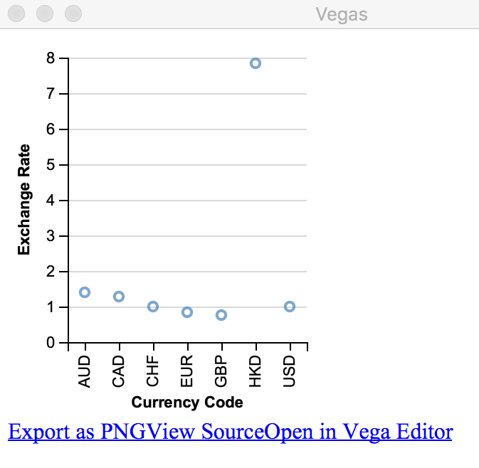
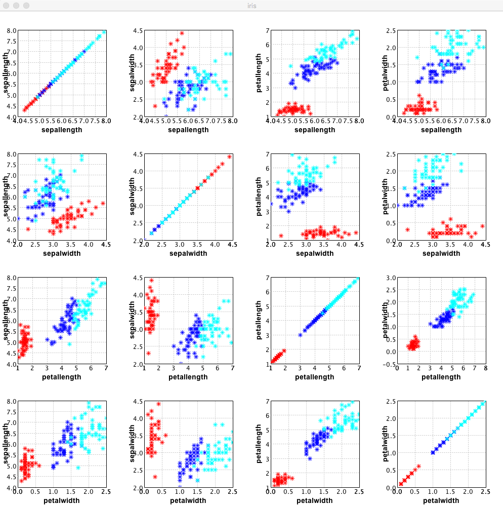

Chapter 2. Data Analysis Life Cycle
--------------------------------------------


The following are the topics that we will be covering in this chapter:


- Data journey
- Sourcing data
- Understanding data
- Using machine learning to learn from data
- Creating a data pipeline


Data journey 
------------------------------

Next,we will look at an example of data analysis involving a life cycle task, focusing on the following broad categories:


- Sourcing data
- Understanding data
- Using ML to learn from data
- Creating a data pipeline


### Data formats


By its very nature, there is a wide variety
of raw data. There are a variety of systems generating raw data for a
variety of purposes. The format of data also varies in each of these
cases. To perform meaningful data analysis, we need to deal with these
various formats and variables effectively. In this section, we will
begin by looking at the three most prevalent data formats: XML, JSON,
and CSV. 


#### XML


[**Extensible Markup Language**] ([**XML**]) is a
simple and popular data format that is commonly used for exchanging
databetween the enterprise system (<https://www.w3.org/XML/>). Scala has
excellent support for processing XML data
using the `scala-xml` library.

Let\'s start by adding dependencies to the
`scala-xml` library to `build.sbt`, as shown in
the following code:

```
libraryDependencies ++= Seq(
"org.scala-lang.modules" %% "scala-xml" % "1.1.0"// Scala XML library
)
```

Let\'s explore some of the features of how this library works, as shown
in the following code:


1.  Import `Elem` from `scala.xml` package:


```
scala> import scala.xml.Elem
import scala.xml.Elem
```

2.  Define a `Person` case class:


```
scala> case class Person(id: String, fname: String, lname: String, age: Option[Int] = None) // class for holding Person object
defined class Person
```

3.  Create an XML message:


```
scala> val personXml: Elem = <person id="123"><fname>John</fname><lname>Doe</lname><age>21</age></person> // sample XML data
personXml: scala.xml.Elem = <person id="123"><fname>John</fname><lname>Doe</lname><age>21</age></person>
```

4.  Extract the `id` XML attribute from XML message:


```
scala> val id = personXml \@ "id" // extract XML attribute
id: String = 123
```

5.  Extract `fname` XML element from XML message:


```
scala> val fname = personXml \ "fname" // XML element extraction 
fname: scala.xml.NodeSeq = NodeSeq(<fname>John</fname>)
```

6.  Extract `lname` XML element from XML message:


```
scala> val lname = personXml \ "lname"
lname: scala.xml.NodeSeq = NodeSeq(<lname>Doe</lname>)
```

7.  Extract `age` XML element from XML message:


```
scala> val age = personXml \ "age"
age: scala.xml.NodeSeq = NodeSeq(<age>21</age>)
```

8.  Now construct `Person` object from extracted values:


```
scala> val person = Person(id, fname.text, lname.text, Some(age.text.toInt)) // to extract value from element, we need to use text
person: Person = Person(123,John,Doe,Some(21))
```

As you can see, the `scala-xml` library makes it really
convenient to parse XML data. Creating XML is equally straightforward,
as illustrated in the following code:

```
scala> import scala.xml.Elem
import scala.xml.Elem

scala> case class Person(id: String, fname: Strig, lname: String, age: Option[Int] = None)
defined class Person

scala> def toXml(p: Person): Elem = { <person id={p.id}><fname>{p.fname}</fname><lname>{p.lname}</lname><age>{p.age.getOrElse(-1)}</age></person> }
toXml: (p: Person)scala.xml.Elem

scala> val person = Person("123", "John", "Doe", Some(21))
person: Person = Person(123,John,Doe,Some(21))

scala> toXml(person)
res0: scala.xml.Elem = <person id="123"><fname>John</fname><lname>Doe</lname><age>21</age></person>
```

Spark has excellent support for processing XML data files using the
`spark-xml` library
(<https://github.com/databricks/spark-xml>). We will be covering this in
upcoming chapters on Spark and distributed processing. In addition,
Java\'s native and add-on libraries have excellent support for XML
processing, which can also be used with Scala code seamlessly. 


#### JSON


We will use the Scala `json4s`
(<http://json4s.org/>) library to work with JSON data. We will be using
a native library that is the same or similar to the Scala
`Lift` library.

Let\'s set up `build.sbt` with the following dependency and
restart SBT using the following code:

```
libraryDependencies ++= Seq(
  "org.json4s" %% "json4s-native" % "3.6.1" // Scala Lift JSON Library
)
```

In the Scala REPL console, explore the library using Scala REPL, as
shown in the following code:

```
scala> import org.json4s._
import org.json4s._

scala> import org.json4s.native.JsonMethods._
import org.json4s.native.JsonMethods._

scala> implicit val formats = DefaultFormats
formats: org.json4s.DefaultFormats.type = org.json4s.DefaultFormats$@59db09a7

scala> case class Person(id: String, fname: String, lname: String, age: Int)
defined class Person

scala> val personStr = """{
     | "id": "123",
     | "fname": "John",
     | "lname": "Doe",
     | "age": 21
     | }"""
personStr: String =
{
  "id": "123",
  "fname": "John",
  "lname": "Doe",
  "age": 21
}

scala> val json = parse(personStr) // parses JSON string to JValue
json: org.json4s.JValue = JObject(List((id,JString(123)), (fname,JString(John)), (lname,JString(Doe)), (age,JInt(21))))

scala> val person = json.extract[Person] // convert to Person object
person: Person = Person(123,John,Doe,21)
```

As you can see in the preceding code, parsing JSON is fairly
straightforward using this library. Another great feature of the library
is that a parsed JSON object can be easily extracted into a Scala case
class object.

Creating JSON is equally straightforward, as shown in the following
code:

```
scala> import org.json4s.native.JsonMethods._
import org.json4s.native.JsonMethods._

scala> import org.json4s.JsonDSL._
import org.json4s.JsonDSL._

scala> val json = ("id" -> "123") ~ ("fname" -> "John") ~ ("lname" -> "Doe") ~ ("age" -> 21) // build JSON object
json: org.json4s.JsonAST.JObject = JObject(List((id,JString(123)), (fname,JString(John)), (lname,JString(Doe)), (age,JInt(21))))

scala> compact(render(json)) // create compact JSON string
res0: String = {"id":"123","fname":"John","lname":"Doe","age":21}
```

Spark has excellent built-in support for processing JSON data files. We
will be covering this in upcoming chapters on Spark and distributed
processing. There are also several excellent Java libraries supporting
JSON processing that can be easily integrated into Scala code.


#### CSV


We will be looking at how to handle CSV parsing using the Apache commons
CSV Java library. This example will also demonstrate how easily Java
libraries can be used with Scala code.

First, let\'s set up our `build.sbt` with the appropriate
dependency using the following code:

```
libraryDependencies ++= Seq(
  "org.apache.commons" % "commons-csv" % "1.6" // Apache Commons CSV Java Library
)
```

Rerun SBT and explore the following code in Scala code. In this example,
we are using a dataset that is available as part of the US government\'s
Open Data initiative. This dataset is related to the 2010 census data of
the City of Los Angeles in California:

```
scala> import java.io.{BufferedReader, InputStreamReader}
import java.io.{BufferedReader, InputStreamReader}

scala> import java.util.function.Consumer
import java.util.function.Consumer

scala> import org.apache.commons.csv.{CSVFormat, CSVRecord}
import org.apache.commons.csv.{CSVFormat, CSVRecord}

scala> import scala.collection.mutable.ListBuffer
import scala.collection.mutable.ListBuffer

scala> case class CensusData(zipCode: String, totalPopulation: Int, medianAge: Double,
     | totalMales: Int, totalFemales: Int, totalHouseholds: Int, averageHouseholdSize: Double)
defined class CensusData

scala> class DataConsumer extends Consumer[CSVRecord] {
     | val buf = ListBuffer[CensusData]()
     | override def accept(t: CSVRecord): Unit = {
     | buf += CensusData(t.get(0), t.get(1).toInt, t.get(2).toDouble,
     | t.get(3).toInt, t.get(4).toInt, t.get(5).toInt, t.get(6).toDouble)
     | }
     | }
defined class DataConsumer

scala> val reader = new BufferedReader(
     | new InputStreamReader(
     | new java.net.URL("https://data.lacity.org/api/views/nxs9-385f/rows.csv?accessType=DOWNLOAD").openStream()
     | )
     | )
reader: java.io.BufferedReader = java.io.BufferedReader@4c83902

scala> val csvParser = CSVFormat.RFC4180.withFirstRecordAsHeader().parse(reader)
csvParser: org.apache.commons.csv.CSVParser = org.apache.commons.csv.CSVParser@543b331c

scala> val dataConsumer = new DataConsumer
dataConsumer: DataConsumer = DataConsumer@3254eeb8

scala> csvParser.forEach(dataConsumer)

scala> val allRecords = dataConsumer.buf.toList
allRecords: List[CensusData] = List(CensusData(91371,1,73.5,0,1,1,1.0), CensusData(90001,57110,26.6,28468,28642,12971,4.4), CensusData(90002,51223,25.5,24876,26347,11731,4.36), CensusData(90003,66266,26.3,32631,33635,15642,4.22), CensusData(90004,62180,34.8,31302,30878,22547,2.73), CensusData(90005,37681,33.9,19299,18382,15044,2.5), CensusData(90006,59185,32.4,30254,28931,18617,3.13), CensusData(90007,40920,24.0,20915,20005,11944,3.0), CensusData(90008,32327,39.7,14477,17850,13841,2.33), CensusData(90010,3800,37.8,1874,1926,2014,1.87), CensusData(90011,103892,26.2,52794,51098,22168,4.67), CensusData(90012,31103,36.3,19493,11610,10327,2.12), CensusData(90013,11772,44.6,7629,4143,6416,1.26), CensusData(90014,7005,44.8,4471,2534,4109,1.34), CensusData(90015,18986,...

scala> allRecords.take(3).foreach(println) // Output first 3 records
CensusData(91371,1,73.5,0,1,1,1.0)
CensusData(90001,57110,26.6,28468,28642,12971,4.4)
CensusData(90002,51223,25.5,24876,26347,11731,4.36)
```

As can be seen in the preceding code, we are able to get CSV data from
the URL and then parse it into the Scala case class. Generating CSV data
is even more straightforward.

 

Let\'s go ahead and generate some CSV data using the following code:

```
scala> import org.apache.commons.csv.{CSVFormat, CSVPrinter}
import org.apache.commons.csv.{CSVFormat, CSVPrinter}

scala> val csvPrinter = new CSVPrinter(System.out, CSVFormat.RFC4180.withHeader("fname", "lname", "age"))
fname,lname,age
csvPrinter: org.apache.commons.csv.CSVPrinter = org.apache.commons.csv.CSVPrinter@7ff05a74

scala> csvPrinter.printRecord("Jon", "Doe", "21")
Jon,Doe,21

scala> csvPrinter.printRecord("James", "Bond", "39")
James,Bond,39

scala> csvPrinter.flush()
```

Spark has excellent built-in support for processing CSV data files. We
will be covering this in upcoming chapters on Spark and distributed
processing.


Understanding data 
------------------------------------


Data generally tells a story. However, this is not
obvious just from looking at the data. To
understand data, we need to be able to ask certain questions and get
answers from the data. Asking the right questions in itself requires a
great deal of domain knowledge and experience. Once the questions are
framed, getting the answers from the data is the next crucial task. Data
exploration is an iterative journey because getting answers to questions
generally leads to more questions, and then one has to answer these new
questions using data.

We will look at the following two important techniques for understanding
and exploring data:


- [**Statistical methods**]: Looking at the properties of
    data at an aggregate level
- [**Visual methods**]: Looking at the properties of data
    using visual methods


In fact, in many real scenarios, both of these methods are used in
conjunction with each other to explore data in an effective manner.


### Using statistical methods for data exploration


In this section, we will explore data by looking at some aggregate-level information about the dataset. In a large
enough dataset, looking at every individual record and trying to get
insight could be a fairly time-consuming process. Statistical methods
can help to speed up this process because we can leverage machines for
fast and efficient computation aggregates.

We will first use pure Scala code to explore and get an insight into the
data. Next, we will look at some Scala libraries that simplify this task
even further.


#### Using Scala


Let\'s explore the same dataset from the US
government\'s Open Data initiative that we used for our CSV example.
Let\'s make sure that the `sbt` dependency is defined as
follows:

```
libraryDependencies ++= Seq(
  "org.apache.commons" % "commons-csv" % "1.6" // Apache Commons CSV 
                                                  Java Library
)
```

Launch your SBT and start the Scala console. For the sake of clarity,
all of the steps for processing the CSV have been repeated.

Import the required libraries using the following code:

```
scala> import java.io.{BufferedReader, InputStreamReader}
import java.io.{BufferedReader, InputStreamReader}

scala> import java.util.function.Consumer
import java.util.function.Consumer

scala> import org.apache.commons.csv.{CSVFormat, CSVRecord}
import org.apache.commons.csv.{CSVFormat, CSVRecord}

scala> import scala.collection.mutable.ListBuffer
import scala.collection.mutable.ListBuffer
```

Let\'s move ahead and write our main code, as follows:

```
scala> case class CensusData(zipCode: String, totalPopulation: Int, medianAge: Double,
     | totalMales: Int, totalFemales: Int, totalHouseholds: Int, averageHouseholdSize: Double)
defined class CensusData

scala> class DataConsumer extends Consumer[CSVRecord] {
     | val buf = ListBuffer[CensusData]()
     | override def accept(t: CSVRecord): Unit = {
     | buf += CensusData(t.get(0), t.get(1).toInt, t.get(2).toDouble,
     | t.get(3).toInt, t.get(4).toInt, t.get(5).toInt, t.get(6).toDouble)
     | }
     | }
defined class DataConsumer

scala> val reader = new BufferedReader(
     | new InputStreamReader(
     | new java.net.URL("https://data.lacity.org/api/views/nxs9-385f/rows.csv?accessType=DOWNLOAD").openStream()
     | )
     | )
reader: java.io.BufferedReader = java.io.BufferedReader@572caa8b

scala> val csvParser = CSVFormat.RFC4180.withFirstRecordAsHeader().parse(reader)
csvParser: org.apache.commons.csv.CSVParser = org.apache.commons.csv.CSVParser@19405f70

scala> val dataConsumer = new DataConsumer
dataConsumer: DataConsumer = DataConsumer@20d9ee6f

scala> csvParser.forEach(dataConsumer)

scala> val allRecords = dataConsumer.buf.toList
allRecords: List[CensusData] = List(CensusData(91371,1,73.5,0,1,1,1.0), CensusData(90001,57110,26.6,28468,28642,12971,4.4), CensusData(90002,51223,25.5,24876,26347,11731,4.36), CensusData(90003,66266,26.3,32631,33635,15642,4.22), CensusData(90004,62180,34.8,31302,30878,22547,2.73), CensusData(90005,37681,33.9,19299,18382,15044,2.5), CensusData(90006,59185,32.4,30254,28931,18617,3.13), CensusData(90007,40920,24.0,20915,20005,11944,3.0), CensusData(90008,32327,39.7,14477,17850,13841,2.33), CensusData(90010,3800,37.8,1874,1926,2014,1.87), CensusData(90011,103892,26.2,52794,51098,22168,4.67), CensusData(90012,31103,36.3,19493,11610,10327,2.12), CensusData(90013,11772,44.6,7629,4143,6416,1.26), CensusData(90014,7005,44.8,4471,2534,4109,1.34), CensusData(90015,18986,...
```

Record the analysis using the following code:

```
scala> // Records Analysis

scala> allRecords.size // total records
res1: Int = 319

scala> allRecords.distinct.size // distinct records
res2: Int = 319

scala> allRecords.take(3) // 3 records from dataset
res3: List[CensusData] = List(CensusData(91371,1,73.5,0,1,1,1.0), CensusData(90001,57110,26.6,28468,28642,12971,4.4), CensusData(90002,51223,25.5,24876,26347,11731,4.36))

scala> // Zip Code Analysis

scala> allRecords.map(_.zipCode).distinct.size // distinct zipCode
res4: Int = 319

scala> allRecords.map(_.zipCode).min // minimum zipCode
res5: String = 90001

scala> allRecords.map(_.zipCode).max
res6: String = 93591

scala> val averageZip = allRecords.map(_.zipCode).aggregate(0)((a, b) => a + b.toInt, (x, y) => x + y) / allRecords.size
averageZip: Int = 91000

scala> allRecords.map(_.zipCode.toInt).sum /allRecords.size // another way to compute the same
res7: Int = 91000
```

Perform the total population analysis using the following code:

```
scala> // Total Population Analysis

scala> allRecords.map(_.totalPopulation).sum
res8: Int = 10603988

scala> val averagePop = allRecords.map(_.totalPopulation).sum / allRecords.size
averagePop: Int = 33241

scala> allRecords.sortBy(_.totalPopulation).head // record with lowest Population
res9: CensusData = CensusData(90079,0,0.0,0,0,0,0.0)

scala> allRecords.sortBy(-_.totalPopulation).head // record with highest Population
res10: CensusData = CensusData(90650,105549,32.5,52364,53185,27130,3.83)

scala> // Aggregate total numbers using a single aggregate method

scala> val (totalPopulation, totalMales, totalFemales, totalHouseholds) = allRecords.aggregate((0, 0, 0, 0))((a, b) => (a._1 + b.totalPopulation, a._2 + b.totalMales, a._3 + b.totalFemales, a._4 + b.totalHouseholds), (x,y) => (x._1 + y._1, x._2 + y._2, x._3 + y._3, x._4 + y._4))
totalPopulation: Int = 10603988
totalMales: Int = 5228909
totalFemales: Int = 5375079
totalHouseholds: Int = 3497698
```

As can be seen in the preceding code, the Scala collection API comes in
handy when performing data analysis. Also, note
the `aggregate` method of the API; it is a generalized way to
create an aggregated value over a collection. Let\'s look at some more
ways to create aggregate values in Scala, as
shown in the following code:

```
scala> // Aggregate using foldLeft

scala> allRecords.map(_.totalPopulation).foldLeft(0)(_+_)
res11: Int = 10603988

scala> allRecords.map(_.totalMales).foldLeft(0)(_+_)
res12: Int = 5228909

scala> allRecords.map(_.totalFemales).foldLeft(0)(_+_)
res13: Int = 5375079

scala> allRecords.map(_.totalHouseholds).foldLeft(0)(_+_)
res14: Int = 3497698

scala> // Aggregate using foldRight

scala> allRecords.map(_.totalPopulation).foldRight(0)(_+_)
res15: Int = 10603988

scala> allRecords.map(_.totalMales).foldRight(0)(_+_)
res16: Int = 5228909

scala> allRecords.map(_.totalFemales).foldRight(0)(_+_)
res17: Int = 5375079

scala> allRecords.map(_.totalHouseholds).foldRight(0)(_+_)
res18: Int = 3497698

scala> // Aggregate using reduce

scala> allRecords.map(_.totalPopulation).reduce(_+_)
res19: Int = 10603988

scala> allRecords.map(_.totalMales).reduce(_+_)
res20: Int = 5228909

scala> allRecords.map(_.totalFemales).reduce(_+_)
res21: Int = 5375079

scala> allRecords.map(_.totalHouseholds).reduce(_+_)
res22: Int = 3497698
```


### Note

Note that we are getting the same results using
the `foldLeft`, `foldRight`, and `reduce`
methods.


#### Other Scala tools


Spark is a very popular distributed data-processing engine. It has
built-in support for exploring data in many different formats. We will
look at Spark functionality in subsequent chapters. Let\'s look at
another Scala library called
[**Saddle**] (<http://saddle.github.io/>) and see how we can
leverage this library to work with data.

This library is not yet available for Scala 2.12, so we will be using
Scala 2.11.12 to explore this library. Configure your
`sbt build.sbt` file as follows:

```
scalaVersion := "2.11.12"

libraryDependencies ++= Seq(
  "org.scala-saddle" %% "saddle-core" % "1.3.4"
)
```

For this exploration using Saddle, we will continue to use the dataset
that we used in our earlier exercise. In your `sbt` console,
try the following:

```
scala> import java.io.{BufferedReader, InputStreamReader}
import java.io.{BufferedReader, InputStreamReader}

scala> import org.saddle.io._
import org.saddle.io._

scala> class SaddleCsvSource(url: String) extends CsvSource {
     | val reader = new BufferedReader(new InputStreamReader(new java.net.URL(url).openStream()))
     | override def readLine: String = {
     | reader.readLine()
     | }
     | }
defined class SaddleCsvSource

scala> val file = new SaddleCsvSource("https://data.lacity.org/api/views/nxs9-385f/rows.csv?accessType=DOWNLOAD")
file: SaddleCsvSource = SaddleCsvSource@6437b766

scala> val frame = CsvParser.parse(file)
frame: org.saddle.Frame[Int,Int,String] =
[320 x 7]
              0 1 2 3 4 5 6
-------- ---------------- ---------- ----------- ------------- --------
  0 -> Zip Code Total Population Median Age Total Males Total Females Total Households Average Household Size
  1 -> 91371 1 73.5 0 1 1 1
  2 -> 90001 57110 26.6 28468 28642 12971 4.4
  3 -> 90002 51223 25.5 24876 26347 11731 4.36
  4 -> 90003 66266 26.3 32631 33635 1564...
scala> frame.print() // prints 10 records from the frame
[320 x 7]
              0 1 2 3 4 5 6
-------- ---------------- ---------- ----------- ------------- --------
  0 -> Zip Code Total Population Median Age Total Males Total Females Total Households Average Household Size
  1 -> 91371 1 73.5 0 1 1 1
  2 -> 90001 57110 26.6 28468 28642 12971 4.4
  3 -> 90002 51223 25.5 24876 26347 11731 4.36
  4 -> 90003 66266 26.3 32631 33635 15642 4.22
...
315 -> 93552 38158 28.4 18711 19447 9690 3.93
316 -> 93553 2138 43.3 1121 1017 816 2.62
317 -> 93560 18910 32.4 9491 9419 6469 2.92
318 -> 93563 388 44.5 263 125 103 2.53
319 -> 93591 7285 30.9 3653 3632 1982 3.67
```

If you are familiar with R or Python\'s pandas library, you will find a
great deal of similarity between Saddle\'s API and these APIs. The
`frame` object that we constructed previously lets us work
with the data at a higher level of abstraction using Saddle\'s API.
Let\'s further explore Saddle\'s frame API, as shown in the following
code:

```
scala> val df = frame.withColIndex(0) // first row is the CSV header
df: org.saddle.Frame[Int,String,String] = [319 x 7]
       Zip Code Total Population Median Age Total Males Total Females Total Households Average Household Size
-------- ---------------- ---------- ----------- ------------- --------
  1 -> 91371 1 73.5 0 1 1 1
  2 -> 90001 57110 26.6 28468 28642 12971 4.4
  3 -> 90002 51223 25.5 24876 26347 11731 4.36
  4 -> 90003 66266 26.3 32631 33635 15642 4.22
  5 -> 90004 62180 34.8 31302 30878 2254...
scala> df.col("Zip Code") // we can access each column by name
res1: org.saddle.Frame[Int,String,String] =
[319 x 1]
       Zip Code
       --------
  1 -> 91371
  2 -> 90001
  3 -> 90002
  4 -> 90003
  5 -> 90004
...
315 -> 93552
316 -> 93553
317 -> 93560
318 -> 93563
319 -> 93591

scala> df.col("Zip Code").min // should fail
<console>:17: error: No implicit view available from org.saddle.Series[_, String] => org.saddle.stats.VecStats[String].
       df.col("Zip Code").min // should fail
                          ^

scala> df.col("Zip Code").mapValues(CsvParser.parseInt).min // convert from string to integer
res3: org.saddle.Series[String,Int] =
[1 x 1]
Zip Code -> 90001
```

The preceding example demonstrates how to work with a frame that
consists of rows and columns. It also shows you how to extract a
specific column using the qualified name and compute some simple stats,
such as `min`.

Next, let\'s look at how to get the same information using Saddle. Here,
we\'ll try obtaining the ZIP codes using the following code:

```
scala> df.col("Zip Code").mapValues(CsvParser.parseInt).min
res4: org.saddle.Series[String,Int] =
[1 x 1]
Zip Code -> 90001

scala> df.col("Zip Code").mapValues(CsvParser.parseInt).max
res5: org.saddle.Series[String,Int] =
[1 x 1]
Zip Code -> 93591

scala> df.col("Zip Code").mapValues(CsvParser.parseInt).mean
res6: org.saddle.Series[String,Double] =
[1 x 1]
Zip Code -> 91000.6740
```

Next, let\'s obtain the total population using the following code:

```
scala> df.col("Total Population").mapValues(CsvParser.parseInt).min
res7: org.saddle.Series[String,Int] =
[1 x 1]
Total Population -> 0

scala> df.col("Total Population").mapValues(CsvParser.parseInt).max
res8: org.saddle.Series[String,Int] =
[1 x 1]
Total Population -> 105549

scala> df.col("Total Population").mapValues(CsvParser.parseInt).sum
res9: org.saddle.Series[String,Int] =
[1 x 1]
Total Population -> 10603988
```

Next, let\'s find the total number of males using the following code:

```
scala> df.col("Total Males").mapValues(CsvParser.parseInt).min
res10: org.saddle.Series[String,Int] =
[1 x 1]
Total Males -> 0

scala> df.col("Total Males").mapValues(CsvParser.parseInt).max
res11: org.saddle.Series[String,Int] =
[1 x 1]
Total Males -> 52794

scala> df.col("Total Males").mapValues(CsvParser.parseInt).sum
res12: org.saddle.Series[String,Int] =
[1 x 1]
Total Males -> 5228909
```

Next, let\'s find the total number of females using the following code:

```
scala> df.col("Total Females").mapValues(CsvParser.parseInt).min
res13: org.saddle.Series[String,Int] =
[1 x 1]
Total Females -> 0

scala> df.col("Total Females").mapValues(CsvParser.parseInt).max
res14: org.saddle.Series[String,Int] =
[1 x 1]
Total Females -> 53185

scala> df.col("Total Females").mapValues(CsvParser.parseInt).sum
res15: org.saddle.Series[String,Int] =
[1 x 1]
Total Females -> 5375079 
```

Now let\'s find the total number of households using the following code:

```
scala> df.col("Total Households").mapValues(CsvParser.parseInt).min
res16: org.saddle.Series[String,Int] =
[1 x 1]
Total Households -> 0

scala> df.col("Total Households").mapValues(CsvParser.parseInt).max
res17: org.saddle.Series[String,Int] =
[1 x 1]
Total Households -> 31087

scala> df.col("Total Households").mapValues(CsvParser.parseInt).sum
res18: org.saddle.Series[String,Int] =
[1 x 1]
Total Households -> 3497698
```

Saddle\'s Scala library has a lot more to offer in terms of computing useful statistical information and working with
data. Let\'s implement some other methods supported by Saddle using the
following code:

```
scala> df.numRows
res19: Int = 319

scala> df.numCols
res20: Int = 7

scala> df.col("Total Households").mapValues(CsvParser.parseInt).mean
res21: org.saddle.Series[String,Double] =
[1 x 1]
Total Households -> 10964.5705

scala> df.col("Total Households").mapValues(CsvParser.parseInt).median
res22: org.saddle.Series[String,Double] =
[1 x 1]
Total Households -> 10968.0000

scala> df.col("Total Households").mapValues(CsvParser.parseInt).stdev
res23: org.saddle.Series[String,Double] =
[1 x 1]
Total Households -> 6270.6464
```

Let\'s see a list of the total number of households, as shown in the
following code:

```
// convert to Scala List
scala> df.col("Total 
      Households").mapValues(CsvParser.parseInt).toSeq.map(_._3).toList 

res24: List[Int] = List(1, 12971, 11731, 15642, 22547, 15044, 18617, 11944, 13841, 2014, 22168, 10327, 6416, 4109, 7420, 16145, 9338, 15493, 23344, 16514, 1561, 17023, 10727, 17903, 21228, 24956, 21929, 14964, 13883, 11156, 12765, 12924, 25592, 12814, 18646, 15869, 11928, 11436, 3317, 9513, 19892, 16075, 25144, 15224, 28534, 16168, 11821, 16657, 3371, 15658, 892, 9596, 6892, 9155, 13260, 10968, 14476, 23985, 1510, 12326, 13364, 0, 4, 3615, 0, 31, 0, 2949, 2, 24104, 8669, 3706, 5567, 12741, 11630, 7520, 12883, 6605, 7632, 13617, 12687, 7085, 15830, 3427, 8880, 31087, 9550, 18419, 10429, 14669, 0, 7174, 14038, 6554, 9212, 9479, 15618, 16910, 16009, 23278, 2612, 14261, 12654, 6575, 11895, 10684, 7290, 6634, 5933, 4188, 5301, 13970, 10089, 14376, 14610, 5717, 17183, 11580, 14244, 0, 11027, ...
```

As we can see from the preceding examples, Saddle\'s API has a lot to
offer in terms of conveniently exploring and
working with data.


### Note 

Please note that while Saddle works well in a single [**Java Virtual
Machine**] ([**JVM**]), it is not designed for data
processing in a distributed environment.


Spark is better for working with data in a distributed environment and
for processing data at a large scale. We will look at Spark in
subsequent chapters.


### Using data visualization for data exploration


Using the data visualization methodology, we can get an
insight into the data by looking at the
visual representation of the data. We will be looking at a fairly
popular Scala library to do some simple exploration in Scala.

 


#### Using the vegas-viz library for data visualization


We will explore some sample dates using the
`vegas-viz` (<https://www.vegas-viz.org/>) Scala library for
data visualization. This is a powerful Scala library that integrates very well with Spark. We will work with
Spark in subsequent chapters.

To explore this library in `sbt`, we will first set up the
`build.sbt` file using the following code. At the time of
writing, `vegas-viz` and Spark are only supported for Scala
2.11.x, so we will use Scala version 2.11.12 for our exploration:

```
// We will use Scala 2.11.x because many of Scala libraries such as
// Spark, vegas-viz are not yet supported for Scala 2.12.x
scalaVersion := "2.11.12"

libraryDependencies ++= Seq(
  "org.vegas-viz" %% "vegas" % "0.3.11" // Vegas Visualization Library
)
```

After creating the aforementioned `build.sbt`, run SBT. Once
inside SBT, run the following console command to start Scala REPL:

```
scala> val plot = Vegas("Currency Exchange Rates").
     | withData(
     | Seq(
     | Map("Currency Code" -> "USD", "Exchange Rate" -> 1.00),
     | Map("Currency Code" -> "EUR", "Exchange Rate" -> 0.86),
     | Map("Currency Code" -> "GBP", "Exchange Rate" -> 0.76),
     | Map("Currency Code" -> "CHF", "Exchange Rate" -> 0.99),
     | Map("Currency Code" -> "CAD", "Exchange Rate" -> 1.29),
     | Map("Currency Code" -> "AUD", "Exchange Rate" -> 1.41),
     | Map("Currency Code" -> "HKD", "Exchange Rate" -> 7.83)
     | )
     | ).
     | encodeX("Currency Code", Nom).
     | encodeY("Exchange Rate", Quant).
     | mark(Point)
```

Done. Now, let\'s plot the following:

```
plot: vegas.DSL.ExtendedUnitSpecBuilder = ExtendedUnitSpecBuilder(ExtendedUnitSpec(None,None,Point,Some(Encoding(None,None,Some(PositionChannelDef(None,None,None,Some(Currency Code),Some(Nominal),None,None,None,None,None)),Some(PositionChannelDef(None,None,None,Some(Exchange Rate),Some(Quantitative),None,None,None,None,None)),None,None,None,None,None,None,None,None,None,None,None)),None,Some(Currency Exchange Rates),Some(Data(None,None,Some(List(Values(Map(Currency Code -> USD, Exchange Rate -> 1.0)), Values(Map(Currency Code -> EUR, Exchange Rate -> 0.86)), Values(Map(Currency Code -> GBP, Exchange Rate -> 0.76)), Values(Map(Currency Code -> CHF, Exchange Rate -> 0.99)), Values(Map(Currency Code -> CAD, Exchange Rate -> 1.29)), Values(Map(Currency Code -> AUD, Exchange Rate -> 1.41)), ...
scala> plot.show
```

This will produce the following scatter plot of **`Currency Code`**
versus **`Exchange Rate`** (USD):





Change the plot mark to `Bar` to output the bar chart using
the following code:

```
val plot = Vegas("Currency Exchange Rates").
...
  mark(Bar) // for bar chart
```

This produces the following bar chart:


As we can see, by using the `vegas-viz` Scala library, we can
easily perform data visualization using a simple set of APIs.


### Setting up Smile


There are multiple ways to set up Smile on
your machine. Refer to Smile Quick Start
at <https://haifengl.github.io/smile/quickstart.html> for more
information. The easiest and fastest way to get started is to download
the binaries from <https://github.com/haifengl/smile/releases>.

The following is a set of commands that are used to perform the Smile
setup:

```
$ curl -L -o smile-1.5.1.zip https://github.com/haifengl/smile/releases/download/v1.5.1/smile-1.5.1.zip # download and save in zip file
  % Total % Received % Xferd Average Speed Time Time Time Current
                                 Dload Upload Total Spent Left Speed
100 605 0 605 0 0 1729 0 --:--:-- --:--:-- --:--:-- 1733
100 165M 100 165M 0 0 11.2M 0 0:00:14 0:00:14 --:--:-- 12.2M

$ unzip smile-1.5.1.zip # unzip file
Archive: smile-1.5.1.zip
  inflating: smile-1.5.1/smile_config.txt
  inflating: smile-1.5.1/bin/init.scala
  inflating: smile-1.5.1/bin/libblas3.dll
...
  inflating: smile-1.5.1/lib/com.github.javaparser.javaparser-core-3.2.5.jar
  inflating: smile-1.5.1/lib/com.github.scopt.scopt_2.12-3.5.0.jar
  inflating: smile-1.5.1/bin/smile
  inflating: smile-1.5.1/bin/smile.bat

$ cd smile-1.5.1 # Smile is setup in this directory

$ ls -1 # List the contents
bin
conf
data
doc
examples
lib
smile_config.txt

$ ls -l bin/smile # This is the Smile start up script
-rwxr-xr-x 1 uid gid 12980 Feb 25 2018 bin/smile
```

Once the setup is complete, let\'s confirm that it is working properly
using the following code. Note that there is a JVM memory parameter that
might have to be adjusted depending upon the size of the dataset that is
being worked on:

```
$ ./bin/smile -J-Xmx2048M # 2048M (2 GB) of memory to JVM
Compiling (synthetic)/ammonite/predef/interpBridge.sc
Compiling (synthetic)/ammonite/predef/replBridge.sc
Compiling (synthetic)/ammonite/predef/DefaultPredef.sc
Compiling (synthetic)/ammonite/predef/CodePredef.sc

                                                       ..::''''::..
                                                     .;'' ``;.
     .... :: :: :: ::
   ,;' .;: () ..: :: :: :: ::
   ::. ..:,:;.,:;. . :: .::::. :: .:' :: :: `:. ::
    '''::, :: :: :: `:: :: ;: .:: :: : : ::
  ,:'; ::; :: :: :: :: :: ::,::''. :: `:. .:' ::
  `:,,,,;;' ,;; ,;;, ;;, ,;;, ,;;, `:,,,,:' `;..``::::''..;'
                                                       ``::,,,,::''

  Welcome to Smile Shell; enter 'help<RETURN>' for the list of commands.
  Type "exit<RETURN>" to leave the Smile Shell
  Version 1.5.1, Scala 2.12.4, SBT 1.1.0, Built at 2018-02-26  
                                          02:31:25.456
=======================================================================
```

Let\'s see what things can be done using the Smile shell, as shown in
the following code:

```
smile> help

 General:
   help -- print this summary
   :help -- print Scala shell command summary
   :quit -- exit the shell
   demo -- show demo window
   benchmark -- benchmark tests

 I/O:
   read -- Reads an object/model back from a file created by write command.
...
 Classification:
   knn -- K-nearest neighbor classifier.
   logit -- Logistic regression.
...
 Regression:
   ols -- Ordinary least square.
   ridge -- Ridge regression.
   lasso -- Least absolute shrinkage and selection operator.
...
 Graphics:
   plot -- Scatter plot.
   line -- Scatter plot which connects points by straight lines.
   boxplot -- Boxplots can be useful to display differences between populations.
...
```

As can be seen from the `help` message, Smile supports a wide
range of classification and regression ML algorithms. Another nice
feature of Smile is that it also has support for data visualization.


### Running Smile


To explore Smile, we will run some of the 
examples that are included with the Smile code base.

The following is an example of applying a random forest algorithm to the
data:

```
smile> val data = read.arff("data/weka/iris.arff", 4)
data: AttributeDataset = iris
  class sepallength sepalwidth petallength petalwidth
[1] Iris-setosa 5.1000 3.5000 1.4000 0.2000
[2] Iris-setosa 4.9000 3.0000 1.4000 0.2000
[3] Iris-setosa 4.7000 3.2000 1.3000 0.2000
[4] Iris-setosa 4.6000 3.1000 1.5000 0.2000
[5] Iris-setosa 5.0000 3.6000 1.4000 0.2000
[6] Iris-setosa 5.4000 3.9000 1.7000 0.4000
[7] Iris-setosa 4.6000 3.4000 1.4000 0.3000
[8] Iris-setosa 5.0000 3.4000 1.5000 0.2000
[9] Iris-setosa 4.4000 2.9000 1.4000 0.2000
[10] Iris-setosa 4.9000 3.1000 1.5000 0.1000
140 more rows...

smile> val (x, y) = data.unzipInt
x: Array[Array[Double]] = Array(
  Array(5.1, 3.5, 1.4, 0.2),
  Array(4.9, 3.0, 1.4, 0.2),
  Array(4.7, 3.2, 1.3, 0.2),
  Array(4.6, 3.1, 1.5, 0.2),
...
smile> val rf = randomForest(x, y)
[Thread-209] INFO smile.classification.RandomForest - Random forest tree OOB size: 59, accuracy: 89.83%
[Thread-210] INFO smile.classification.RandomForest - Random forest tree OOB size: 52, accuracy: 88.46%
[Thread-213] INFO smile.classification.RandomForest - Random forest tree OOB size: 50, accuracy: 100.00%
...
[Thread-210] INFO smile.classification.RandomForest - Random forest tree OOB size: 56, accuracy: 100.00%
[main] INFO smile.util.package$ - runtime: 97.07988 ms
rf: RandomForest = smile.classification.RandomForest@a4df251

smile> println(s"OOB error = ${rf.error}")
OOB error = 0.04666666666666667


smile> rf.predict(x(0))
res4: Int = 0
```

Let\'s explore the data using Smile\'s visualization features, as shown
in the following code:

```
smile> val iris = read.arff("data/weka/iris.arff", 4)
iris: AttributeDataset = iris
  class sepallength sepalwidth petallength petalwidth
[1] Iris-setosa 5.1000 3.5000 1.4000 0.2000
[2] Iris-setosa 4.9000 3.0000 1.4000 0.2000
[3] Iris-setosa 4.7000 3.2000 1.3000 0.2000
[4] Iris-setosa 4.6000 3.1000 1.5000 0.2000
[5] Iris-setosa 5.0000 3.6000 1.4000 0.2000
[6] Iris-setosa 5.4000 3.9000 1.7000 0.4000
[7] Iris-setosa 4.6000 3.4000 1.4000 0.3000
[8] Iris-setosa 5.0000 3.4000 1.5000 0.2000
[9] Iris-setosa 4.4000 2.9000 1.4000 0.2000
[10] Iris-setosa 4.9000 3.1000 1.5000 0.1000
140 more rows...

smile> plot(iris, '*', Array(Color.RED, Color.BLUE, Color.CYAN)) // plot all the attribute pairs
res1: javax.swing.JFrame = javax.swing.JFrame[frame0,780,191,1000x1000,invalid,layout=java.awt.BorderLayout,title=iris,resizable,normal,defaultCloseOperation=DISPOSE_ON_CLOSE,rootPane=javax.swing.JRootPane[,0,22,1000x978,invalid,layout=javax.swing.JRootPane$RootLayout,alignmentX=0.0,alignmentY=0.0,border=,flags=16777673,maximumSize=,minimumSize=,preferredSize=],rootPaneCheckingEnabled=true]
```

We will then see the following output window:





As we can see, the Smile Scala library has a lot to offer in terms of ML
data visualization. This could be a tool of choice if the data volumes
are not very large. As mentioned earlier, Spark and Vegas would be
better for processing and visualizing large datasets.


Summary 
-------------------------


In this chapter, we looked at the journey of data and the data analysis
life cycle at a broad level. Using hands-on examples, we looked at how
to perform some of the tasks using mainly Scala and some Java libraries.

In the next chapter, we will look at data ingestion and associated
tasks.
